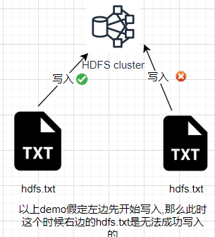

# 概述

## HDFS 产出背景及定义

- 产生背景

> 随着数据量越来越大，在一个操作系统存不下所有的数据，那么就分配到更多的操作系统管理的磁盘中，但是不方便管理和维护，迫切需要一种系统来管理多台机器上的文件，这就是分布式文件管理系统。HDFS 这是分布式文件管理系统中的一种。

- 定义

> HDFS（Hadoop Distributed File System），它是一个文件系统，用于存储文件，通过目录树来定位文件；其次，它是分布式的，由很多服务器联合起来实现其功能，集群中的服务器有各自的角色。

> HDFS 的使用场景：适合一次写入，多次读出的场景。一个文件经过创建、写入和关闭之后就不需要改变。

## HDFS 优缺点

### 优点

- 高兼容性

> 数据自动保存多个副本。它通过增加副本的形式，提高容错性。
>
> 某一个副本丢失后他可以自动恢复。

- 适合处理大数据

> 数据规模: 能够处理数据规模达到GB\TB甚至PB级别的数据
>
> 文件规模: 能够处理百万规模以上的文件数量,数量相当之大

- 可`构建在廉价机器上`,通过多副本机制,提高可靠性

### 缺点

- 不适合低延时数据访问,比如毫秒级的存储数据,是做不到的
- 无法高效的对大量的小文件进行存储

> 存储大量小文件的话,它会占用`NameNode`大量的内存来存储文件目录和块信息.这样是不可取的,因为`NameNode`的内存总是有限的.
>
> 小文件存储的寻址时间会超过读取时间,他违反了 HDFS 的设计目标.

- 不支持并发写入\文件随机修改

> 一个文件只能有一个写,不允许多个县城同时写
>
> 仅支持数据`append(追加)`,不支持文件的随机修改

### HDFS组成架构

> 待补画图，先将实操重点熟练

### HDFS 文件块大小

HDFS中的文件在物理上是分块存储(Block),块的大小可以通过配置参数(dfs.blocksize)来规定,默认大小在`Hadoop2.x/3.x版本中是128M`,`1.x版本是64M`

