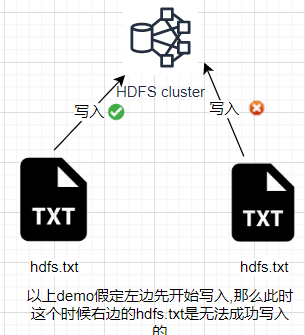

# 概述

## HDFS 产出背景及定义

- 产生背景

> 随着数据量越来越大，在一个操作系统存不下所有的数据，那么就分配到更多的操作系统管理的磁盘中，但是不方便管理和维护，迫切需要一种系统来管理多台机器上的文件，这就是分布式文件管理系统。HDFS 这是分布式文件管理系统中的一种。

- 定义

> HDFS（Hadoop Distributed File System），它是一个文件系统，用于存储文件，通过目录树来定位文件；其次，它是分布式的，由很多服务器联合起来实现其功能，集群中的服务器有各自的角色。

> HDFS 的使用场景：适合一次写入，多次读出的场景。一个文件经过创建、写入和关闭之后就不需要改变。

## HDFS 优缺点

### 优点

- 高兼容性

> 数据自动保存多个副本。它通过增加副本的形式，提高容错性。
>
> 某一个副本丢失后他可以自动恢复。

- 适合处理大数据

> 数据规模: 能够处理数据规模达到GB\TB甚至PB级别的数据
>
> 文件规模: 能够处理百万规模以上的文件数量,数量相当之大

- 可`构建在廉价机器上`,通过多副本机制,提高可靠性

### 缺点

- 不适合低延时数据访问,比如毫秒级的存储数据,是做不到的
- 无法高效的对大量的小文件进行存储

> 存储大量小文件的话,它会占用`NameNode`大量的内存来存储文件目录和块信息.这样是不可取的,因为`NameNode`的内存总是有限的.
>
> 小文件存储的寻址时间会超过读取时间,他违反了 HDFS 的设计目标.

- 不支持并发写入\文件随机修改

> 一个文件只能有一个写,不允许多个县城同时写
>
> 仅支持数据`append(追加)`,不支持文件的随机修改



### HDFS组成架构

> 待补画图，先将实操重点熟练

### HDFS 文件块大小

HDFS中的文件在物理上是分块存储(Block),块的大小可以通过配置参数(dfs.blocksize)来规定,默认大小在`Hadoop2.x/3.x版本中是128M`,`1.x版本是64M`

寻址时间为传输时间的1%时，则为最佳状态。因此，传输时间=`10ms/0.01=1000ms=1s`

HDFS的块设置太小，会增加寻址时间，程序一直在找块的开始位置；

如果块设置的太大，从磁盘传输数据的时间会明显大于定位这个块开始位置所需的时间。导致程序在处理这块数据时，会非常慢。

# HDFS的Shell操作

## 基本语法

`hadoop fs {具体命令}`或者`hdfs dfs {具体命令}`两个是完全相同的。

## 命令大全

- 使用 `hadoop fs`查看基础命令帮助
```shell script
[-appendToFile <localsrc> ... <dst>]
[-cat [-ignoreCrc] <src> ...]
[-checksum <src> ...]
[-chgrp [-R] GROUP PATH...]
[-chmod [-R] <MODE[,MODE]... | OCTALMODE> PATH...]
[-chown [-R] [OWNER][:[GROUP]] PATH...]
[-copyFromLocal [-f] [-p] [-l] [-d] [-t <thread count>] <localsrc> ... <dst>]
[-copyToLocal [-f] [-p] [-ignoreCrc] [-crc] <src> ... <localdst>]
[-count [-q] [-h] [-v] [-t [<storage type>]] [-u] [-x] [-e] <path> ...]
[-cp [-f] [-p | -p[topax]] [-d] <src> ... <dst>]
[-createSnapshot <snapshotDir> [<snapshotName>]]
[-deleteSnapshot <snapshotDir> <snapshotName>]
[-df [-h] [<path> ...]]
[-du [-s] [-h] [-v] [-x] <path> ...]
[-expunge]
[-find <path> ... <expression> ...]
[-get [-f] [-p] [-ignoreCrc] [-crc] <src> ... <localdst>]
[-getfacl [-R] <path>]
[-getfattr [-R] {-n name | -d} [-e en] <path>]
[-getmerge [-nl] [-skip-empty-file] <src> <localdst>]
[-head <file>]
[-help [cmd ...]]
[-ls [-C] [-d] [-h] [-q] [-R] [-t] [-S] [-r] [-u] [-e] [<path> ...]]
[-mkdir [-p] <path> ...]
[-moveFromLocal <localsrc> ... <dst>]
[-moveToLocal <src> <localdst>]
[-mv <src> ... <dst>]
[-put [-f] [-p] [-l] [-d] <localsrc> ... <dst>]
[-renameSnapshot <snapshotDir> <oldName> <newName>]
[-rm [-f] [-r|-R] [-skipTrash] [-safely] <src> ...]
[-rmdir [--ignore-fail-on-non-empty] <dir> ...]
[-setfacl [-R] [{-b|-k} {-m|-x <acl_spec>} <path>]|[--set <acl_spec> <path>]]
[-setfattr {-n name [-v value] | -x name} <path>]
[-setrep [-R] [-w] <rep> <path> ...]
[-stat [format] <path> ...]
[-tail [-f] [-s <sleep interval>] <file>]
[-test -[defsz] <path>]
[-text [-ignoreCrc] <src> ...]
[-touch [-a] [-m] [-t TIMESTAMP ] [-c] <path> ...]
[-touchz <path> ...]
[-truncate [-w] <length> <path> ...]
[-usage [cmd ...]]
```

## 常用命令实操

- 创建`sanguo`文件夹

```shell script
hadoop fs -mkdir /sanguo
```

### 上传

- copyFromLocal

从本地复制粘贴到`HDFS`

```shell script
hadoop fs -copyFromLocal {localPath} {remotePath}
```

- moveFromLocal

从本地剪切粘贴到`HDFS`

```shell script
hadoop fs -moveFromLocal {localPath} {remotePath}
```

- put 等价`copyFromLocal`

```shell script
hadoop fs -put {localPath} {remotePath}
```

- appendToFile

追加一个文件到已经存在的文件末尾

```shell script
hadoop fs -appendToFile {localPath} {remotePath}
```

### 下载

- copyToLocal

从`HDFS`复制到本地

```shell script
hadoop fs -copyToLocal {remotePath} {localPath}
```

- get等价于 copyToLocal

```shell script
hadoop fs -get {remotePath} {localPath}
```

### hdfs直接操作

- ls: 显示目录信息

```shell script
hadoop fs -ls {remotePath}
```

- cat: 显示文件内容

```shell script
hadoop fs -cat {remotePath}
```

- -chgrp、-chmod、-chown：Linux 文件系统中的用法一样，修改文件所属权限

```shell script
hadoop fs -chmod 666 {remotePath}
```

- mkdir: 创建路径

```shell script
hadoop fs -mkdir {remotePath}
```

- cp: 从`HDFS`的一个路径拷贝到`HDFS`的另一个路径

```shell script
hadoop fs -cp {remotePath} {remotePath}
```

- mv: 从`HDFS`的一个路径剪切到`HDFS`的另一个路径

```shell script
hadoop fs -mv {remotePath} {remotePath}
```

- tail: 显示一个文件的穆伟`1kb`的数据

```shell script
hadoop fs -tail {remotePath}
```

- rm: 删除文件或文件夹

```shell script
hadoop fs -rm {remotePath}
hadoop fs -rm -r {remotePath} # 递归删除
```

- du: 统计文件夹的大小信息

- -setrep: 设置HDFS中文件的副本数量

# HDFS的API操作

## 客户端环境准备

- 配置客户端的`HADOOP_HOME`即可

- 配置pom

```xml
<dependencies>
    <dependency>
        <groupId>org.apache.hadoop</groupId>
        <artifactId>hadoop-client</artifactId>
        <version>3.1.3</version>
    </dependency>
    <dependency>
        <groupId>junit</groupId>
        <artifactId>junit</artifactId>
        <version>4.12</version>
    </dependency>
    <dependency>
        <groupId>org.slf4j</groupId>
        <artifactId>slf4j-log4j12</artifactId>
        <version>1.7.30</version>
    </dependency>
</dependencies>
```

- 配置log4j.properties

```properties
log4j.rootLogger=INFO, stdout
log4j.appender.stdout=org.apache.log4j.ConsoleAppender
log4j.appender.stdout.layout=org.apache.log4j.PatternLayout
log4j.appender.stdout.layout.ConversionPattern=%d %p [%c] - %m%n
log4j.appender.logfile=org.apache.log4j.FileAppender
log4j.appender.logfile.File=target/spring.log
log4j.appender.logfile.layout=org.apache.log4j.PatternLayout
log4j.appender.logfile.layout.ConversionPattern=%d %p [%c] - %m%n
```

## API案例实操

请参考 [easyhd](https://github.com/bnyte/easyhd) 项目, 这是一款轻量0侵入的`hadoop Java 客户端`

# 错误异常

- 报错信息
```
Failed to retrieve data from /webhdfs/v1/?op=LISTSTATUS: Server Error
```

- 解决方案

分析: jdk11移除了javax,导致`javax/activation/DataSource`类找不到

下载 [JavaX-activation](https://repo1.maven.org/maven2/javax/activation/activation/1.1.1/activation-1.1.1.jar) 放到hadoop的./share/hadoop/common/lib/ 目录下就好了

- 报错信息

```
在web端可能出现没有权限访问相关的问题，这是因为hdfs开启了安全模式，因为我们是用root启动的，只需要吧安全启动关闭就行了
```

- 解决方案

> 修改所有hadoop集群的`hdfs-site.xml`添加以下内容

```xml
    <!-- 关闭权限校验，允许root用户 -->
    <property>
        <name>dfs.permissions</name>
        <value>false</value>
    </property>
```